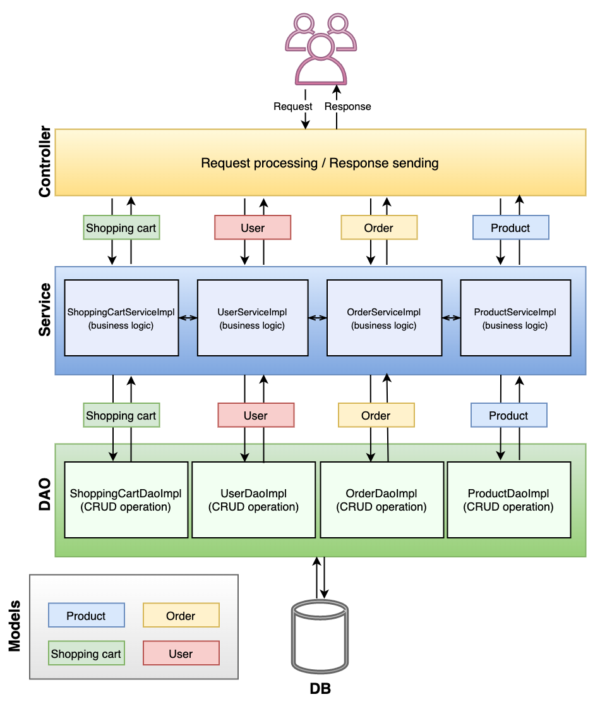

# Internet-Shop
A pet project presented as a classic simple online store with its key features and minimal design.
Can be used as a normal user or as an administrator, the specific features of each are described below.
Implemented with core javaEE and JDBC

## Project structure
The project builds on an N-tier architecture and consists of the controller level which handle requests, service layer with business logic, DAO layer for access to DB and DB itself.

Servlets run on Tomcat server to handle HTTP requests. The DAO layer includes implementation for the JDBC.

This project also includes custom-made annotations and an injector, which utilizes Reflection API.

**Users can perform the following actions:**
- registration;
- log in and out;
- access to full item's list;
- add items to their cart;
- delete items from the cart;
- place orders.

**Admin can perform the following actions:**
- manage users list;
- view all orders placed at the store;
- edit the store's item list.

## Technologies used:
- Java 11
- Javax Servlet API 4.0.1
- JDBC
- JSTL 1.2
- JSP
- Apache Tomcat
- Maven 3.1.1
- MySQL RDBMS
- Bootstrap

## How to set up your internet-shop
1. Clone this repo to your IDE
2. Configure TomCat and MySQL on your local machine
3. In the class ConnectionUtil, fill in the fields to connect to your database (user, password, url)
4. Create a database with init_db.sql script
5. To create user like admin - in registration page fill form "Password for admin" - 1234